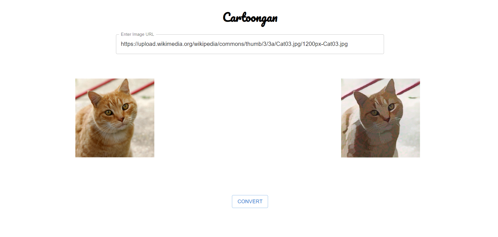

# ReactTFJS
An app to convert images to cartoons using the cartoongan saved model form Tensorflow Hub.  
The model is available as TFLite. The Tensorflow Lite Task Library has been used to deploy the model in ReactJS. 
Live demo at CodeSandbox [here](https://j3vv7.csb.app/). 

   

